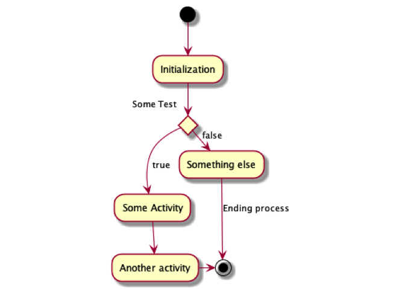
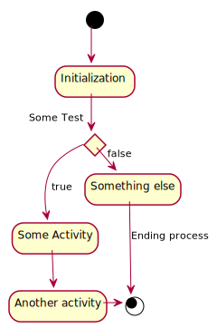
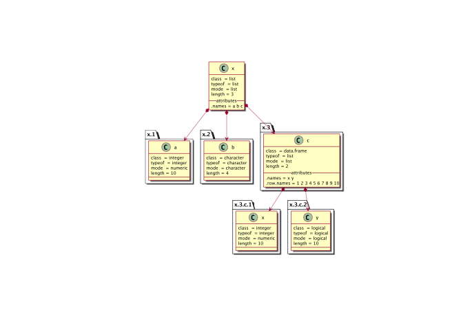

PlantUML in R
================

<!-- README.md is generated from README.Rmd. Please edit that file -->

-----

[](https://travis-ci.org/rkrug/plantuml)
[](https://codecov.io/github/rkrug/plantuml?branch=master)
[](https://www.tidyverse.org/lifecycle/#maturing)

-----

# Overview

This package provides the functionality to create UML graphs using the
[PlantUML](http://plantuml.com/) language.

# Installation

## **<span style="color:red">ATTENTION</span>**

This packege `plantuml` uses the package `grImport` for plotting to a
graphics device. In the CRAN version (`0.9-0`)the function
`PostScriptTrace()` does not clean up a temporary file which iscreated
in theworking directory. This ahs been fixed in R-Forge. I recommend to
install the package from the github mirror from R-Forge by using

``` r
devtools::install_github("rforge/grimport/pkg/grImport")
```

## Prerequisites

The actual work is done by the program [plantuml](http://plantuml.com/).
Please see [the plantuml installation
page](http://plantuml.com/faq-install) for prerequisites of running
plantuml. You don’t have tio install the plantuml.jar file, as the
packagae maintains it’s own version (see below).

As the package is only on github, you need `devtools` to install it
easily as a prerequisite

``` r
install.packages("devtools")
```

## Installation of plantuml

The package is not on CRAN, so you have to install it from github. Also,
it doez not come with the plantuml binary, which needs to be installed
as well:

``` r
# Install plantuml from github
devtools::install_github("rkrug/plantuml")

# download and install the PlantUML jar file from \link{http://plantuml.com/download}
# whenever you call this command again, the plantuml binary will be updated to the newest version
library(plantuml)
updatePlantumlJar()
```

# Plotting Plantuml graphics

## Define plantuml code

First, we define a plantuml object based on some plantuml code

``` r
library(plantuml)
x <- '
(*) --> "Initialization"

if "Some Test" then
  -->[true] "Some Activity"
  --> "Another activity"
  -right-> (*)
else
  ->[false] "Something else"
  -->[Ending process] (*)
endif
'
x <- plantuml( 
  x
)
```

## Plot via vector format

Now we plot in in a device using vector format (svg) as intermediate
format, which is the default

``` r
plot( 
  x = x
# vector = TRUE
  )
```

<!-- -->

## Plot via raster format

When using `vector = FALSE` uses a raster format (png) as intermediate
format

``` r
plot( 
  x = x,
  vector = FALSE
  )
```

<!-- -->

## Plotting to a file

To save the graph in a file, we simply specify the `file` argument in
the plot command:

``` r
plot( 
  x, 
  file = "./README_files/test.svg" 
)
```

And here is the file



The type of the file is automatically determined based on the extension.
Suported extensions in plantuml are:

    - png       To generate images using PNG format (default)
    - svg       To generate images using SVG format
    - eps       To generate images using EPS format
    - pdf       To generate images using PDF format
    - vdx       To generate images using VDX format
    - xmi       To generate XMI file for class diagram
    - scxml     To generate SCXML file for state diagram
    - html      To generate HTML file for class diagram
    - txt       To generate images with ASCII art
    - utxt      To generate images with ASCII art using Unicode characters
    - latex     To generate images using LaTeX/Tikz format
    - latex:nopreamble  To generate images using LaTeX/Tikz format without preamble

# Plotting R objects

In addition to plotting based on plantuml code some basic functionality
to document R objects has been included.

This is not much more than a proof of concept but includes all standard
R objects.

**<span style="color:green">If you think this is usefull, pelase let me
know and leave sugestions in the issue tracker.</span>**

One example is:

``` r
x <- list(
  a = 1:10,
  b = letters[1:4],
  c = data.frame(
    x = 1:10,
    y = c(TRUE, FALSE)
  )
)
plot(
  as.plantuml(x)
)
```

<!-- -->

# **<span style="color:red">TODO</span>**

  - make selection dependant on installed packages, as `vector = TRUE`
    requires postscript to be installed\!
  - update documentation and
  - add tests
